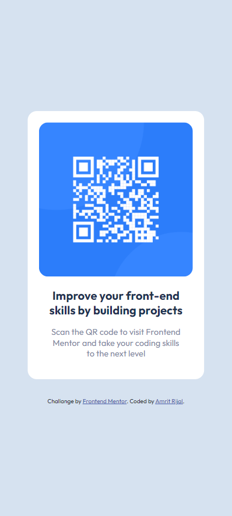

# Frontend Mentor - QR code component solution

## Table of contents

- [Frontend Mentor - QR code component solution](#frontend-mentor---qr-code-component-solution)
  - [Table of contents](#table-of-contents)
  - [Overview](#overview)
    - [Screenshot](#screenshot)
    - [Links](#links)
  - [My process](#my-process)
    - [Built with](#built-with)
    - [What I learned](#what-i-learned)
  - [Author](#author)

## Overview

This is a solution to the [QR code component challenge on Frontend Mentor](https://www.frontendmentor.io/challenges/qr-code-component-iux_sIO_H). Frontend Mentor challenges help you improve your coding skills by building realistic projects. 

### Screenshot

Screenshot of the webpage in desktop resolution.


Screeenshot of the webpage in mobile resolution.



### Links

- Solution URL: [Github solution URL](https://github.com/AmritRijal-cpp/Frontend-Mentor-QR-code-Challange-)
- Live Site URL: [Live site URL](https://amritrijal-cpp.github.io/Frontend-Mentor-QR-code-Challange-/)

## My process

### Built with

- Semaatic HTML5 markup
- CSS custom properties

### What I learned

I learned how to centralize a child class to his parent class.
I did it with the help of flexbox and min-height and min-width.

```css
#main {
      display: flex;
      align-items: center;
      justify-content: center;
      min-width:  100vw;
      min-height: 100vh;
}
```

## Author

- Frontend Mentor - [@AmritRijal-cpp](https://www.frontendmentor.io/profile/AmritRijal-cpp)
- Twitter - [@Amritrijal14](https://twitter.com/Amritrijal14)
